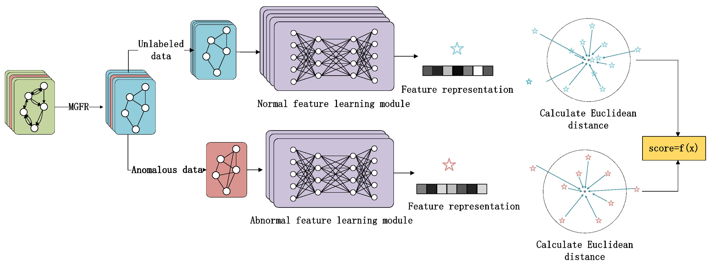

# Dual-channel Graph-level Anomaly Detection Method Based on Multi-Graph Representation Learning

This repository contains the source code for the paper titled "Dual-channel Graph-level Anomaly Detection Method Based on Multi-Graph Representation Learning." The code implements our proposed method for detecting anomalies in graph data using multi-graph representation learning techniques.

## Table of Contents
- [Code Structure](#code-structure)
- [Dataset Directory](#dataset-directory)
- [Model Code Directory](#model-code-directory)
- [Illustrations](#illustrations)
- [Citation](#citation)

## Code Structure

├── data/        
│ └── Datasets/          #Place your datasets here         
├── model/       
│ └── tracemgfr.py    # Our Model         
├── utils/     
│ ├── functions.py       # functions     

## Dataset Directory

The datasets used for experiments are located in the `data/` directory. You can create subdirectories for different datasets, e.g., `data/Datasets/`, and place your dataset files there.

## Model Code Directory

The model implementation can be found in the `model/` directory. The main file, `tracemgfr.py  `, contains the architecture and training routines for our dual-channel graph-level anomaly detection method. The other .py files are the code for the baseline model.

##  train and evaluate Model
 
 `python model/tracemgfr.py`
 
## Illustrations

  
*Figure 1: Overview of the dual-channel anomaly detection framework.*

## Citation

JING,Y., Chen,J., Chen,X.,Wang,H.: Dual-channel Graph-level Anomaly Detection Method Based on Multi-Graph Representation Learning. Applied Intelligence.
